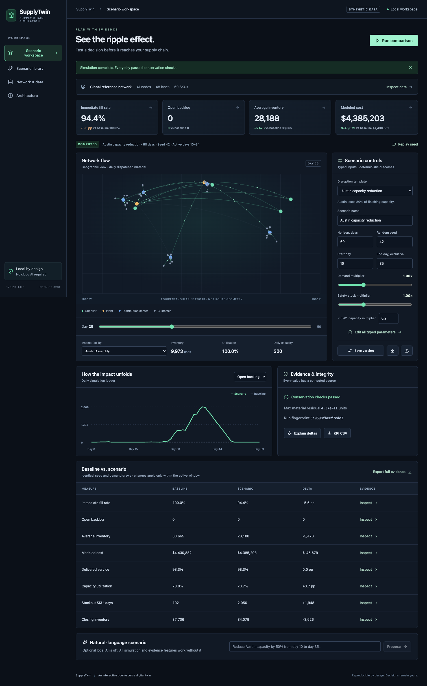
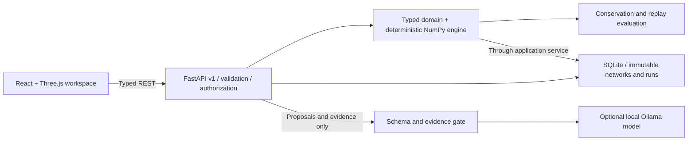

<div align="center">

# SupplyTwin

### See the ripple effect before it reaches your customers.

An interactive open-source digital twin for supply-chain scenario simulation.

**Deterministic simulation · Optional local AI · No paid APIs required · Apache-2.0**

[Get started](#get-started) · [See a real simulation](#a-disruption-ends-its-impact-keeps-moving) · [Explore the architecture](#architecture) · [Inspect the benchmarks](#measured-performance) · [Contribute](#contributing)

</div>

---

**Your plant recovers on day 35. Your customer backlog does not clear until day 50.**

SupplyTwin helps you investigate what happens between those two events. Change demand, capacity, sourcing, inventory policy or transportation, then follow the consequences through suppliers, plants, distribution centers and customers.

Run a baseline. Introduce a disruption. Compare the results. Inspect the evidence.

**The simulation computes every KPI. Optional local AI translates scenario instructions and selects verified evidence for explanations.**



_Actual application screenshot using the included synthetic network. [View full resolution](docs/screenshots/workspace.png) · [View mobile layout](docs/screenshots/mobile.png) · [Reproduce the screenshots](docs/evaluation.md#screenshot-reproduction)_

> **Project status — v0.1.0 local release candidate.** The native application and desktop/mobile workflows have been verified locally. Docker Compose and GitHub Actions configurations are included; Docker execution and hosted CI remain unverified. This distribution is currently kept local. See the [verification record](docs/verification.md) and [release checklist](docs/release-checklist.md).

## A disruption ends. Its impact keeps moving.

The reference scenario removes **80% of Austin Assembly's finishing capacity** for days 10–34 of a 60-day simulation. Inventory buffers initially absorb the change. Downstream effects emerge later, and the backlog continues growing after capacity returns.

|    Day | What the model shows                                     |
| -----: | -------------------------------------------------------- |
| **10** | Austin's capacity falls to 20% of normal.                |
| **19** | Customer backlog first exceeds the paired baseline.      |
| **35** | Austin's normal capacity is restored.                    |
| **39** | Customer backlog peaks at approximately **2,669 units**. |
| **50** | The scenario's customer backlog clears.                  |

The final backlog alone would hide much of this disruption:

| Measure                   |     Baseline | Austin capacity reduction |
| ------------------------- | -----------: | ------------------------: |
| Same-day demand fill rate |       99.96% |                    94.37% |
| Average on-hand inventory | 33,665 units |              28,188 units |
| Stockout node–SKU–days    |          102 |                     2,050 |
| Closing customer backlog  |      0 units |                   0 units |

**Both runs end with zero backlog. Their service experience is very different.**

These are reproducible results from synthetic data, using generator seed **17**, simulation seed **42**, and engine **1.0.0**. They are not observed business outcomes. Days are indexed from zero; scenario windows include the start day and exclude the end day. Inspect the [measured KPI output](docs/benchmarks/example/results.json), replay the [Austin template](data/sample/scenarios.json), or follow the walkthrough below.

## Who it is for

| Team                       | Questions to investigate                                                                |
| -------------------------- | --------------------------------------------------------------------------------------- |
| **Supply planners**        | How long do buffers protect customers when a supplier or plant loses capacity?          |
| **Network planners**       | Which facilities and lanes transmit a disruption to downstream markets?                 |
| **S&OP teams**             | How do demand and capacity changes affect service, inventory and modeled cost together? |
| **Logistics teams**        | What changes when a lane slows down or its capacity drops?                              |
| **Operations researchers** | Can a proposed policy survive a repeatable stress test with inspectable balances?       |

The project also provides a concrete engineering reference for separating numerical models, data validation, persistence, visualization and local AI.

## Get started

The default demo uses synthetic data and requires **no model download, API key or paid account**. Dependencies and container images require an initial download; the main workspace runs locally afterward.

### Docker Compose

From the extracted source bundle or a checkout named `supplytwin`:

```sh
cd supplytwin
cp .env.example .env
docker compose up --build
```

On Windows PowerShell, use `Copy-Item .env.example .env` for the copy step.

| Surface               | Default address                                                          |
| --------------------- | ------------------------------------------------------------------------ |
| Scenario workspace    | [http://localhost:8080](http://localhost:8080)                           |
| API documentation     | [http://localhost:8000/docs](http://localhost:8000/docs)                 |
| OpenAPI specification | [http://localhost:8000/openapi.json](http://localhost:8000/openapi.json) |
| Liveness / readiness  | `http://localhost:8000/health` / `http://localhost:8000/ready`           |

The sample network loads automatically. API and web ports bind to loopback. Data persists in the `supplytwin-data` volume, and `docker compose down` preserves it.

**Verification note:** this Compose configuration is supplied for local execution but has not been run in the build environment, where Docker was unavailable. The [native development path](#native-development) was used for local verification. [The CI workflow](.github/workflows/ci.yml) includes a Compose build and smoke-test job for later verification.

### Your first experiment

1. Open **Scenario workspace** and select **Austin capacity reduction**.
2. Keep the **60-day horizon**, **seed 42**, **start day 10**, **end day 35**, and **PLT-01 capacity multiplier 0.2**.
3. Click **Run comparison** to compute the baseline and scenario using common seeded demand draws.
4. Inspect the **Open backlog** chart, then move the network timeline to days 19, 35 and 39.
5. Select **Austin Assembly** or a downstream DC to inspect inventory and utilization. Click a KPI to see its supporting evidence.
6. Save a scenario version, export the definition, or replay the run with its original seed.

Try a smaller capacity reduction next. A disruption that inventory can absorb should produce a different service outcome; the model does not hardcode a crisis into every scenario.

## What you can do today

| Capability                  | Implemented behavior                                                                                                                 |
| --------------------------- | ------------------------------------------------------------------------------------------------------------------------------------ |
| **Model a network**         | Suppliers, plants, DCs, customers, SKUs, directed lanes, shared capacities, lead times and inventory policies.                       |
| **Stress-test operations**  | Change demand, node capacity, lane capacity, sourcing weights, safety stock and transportation lead times within an explicit window. |
| **Compare outcomes**        | Baseline/scenario KPIs, deltas, daily inventory and backlog, facility utilization, SKU outcomes and cost breakdowns.                 |
| **Trace material flow**     | Three.js network view with animation driven by computed daily dispatch quantities and a day-by-day timeline.                         |
| **Inspect evidence**        | KPI evidence IDs, run fingerprints, network fingerprints and daily material/demand reconciliation.                                   |
| **Reuse experiments**       | Nine disruption templates, immutable scenario versions, persisted runs, seed replay, JSON import/export and CSV KPI export.          |
| **Validate incoming data**  | Strict schemas, reference and graph checks, visible warnings, retained invalid payloads and ingestion audit records.                 |
| **Use local AI optionally** | Reviewable typed parameter proposals and validated evidence selection through Ollama, with abstention and deterministic fallback.    |

Use the form for common changes and **Edit all typed parameters** for node- and lane-specific overrides. Business calculations remain in the backend domain package.

### Nine included disruption templates

| Template                      | Change                                                                 |
| ----------------------------- | ---------------------------------------------------------------------- |
| Demand surge                  | Customer demand rises 40%.                                             |
| Osaka supplier outage         | Osaka stops new production for 25 days; existing stock can still ship. |
| Austin capacity reduction     | Austin loses 80% of finishing capacity.                                |
| Ocean freight delay           | Supplier-to-Austin lead times increase to 14 days.                     |
| Chicago DC outage             | Chicago stops dispatching during the disruption window.                |
| Lean inventory policy         | Safety-stock targets fall to zero during the window.                   |
| Diversify Austin sourcing     | Sourcing weights shift orders away from Osaka.                         |
| Transatlantic lane constraint | Rotterdam–Chicago lane capacity falls 90%.                             |
| Compound disruption           | Demand rises 30% while Austin loses half its capacity.                 |

All templates use explicit parameters. Inspect or modify them in [the sample scenario library](data/sample/scenarios.json).

## What the numbers mean

Operational metrics are useful only when their definitions are clear.

| Metric                  | Definition in this release                                                                                      |
| ----------------------- | --------------------------------------------------------------------------------------------------------------- |
| **Immediate fill rate** | Demand dispatched on the day it arrives, divided by total demand. Older backlog receives priority.              |
| **Delivered service**   | Customer receipts divided by cumulative demand at the horizon. Late receipts count; this is not OTIF.           |
| **Backlog**             | Customer demand that has not yet been dispatched. The daily series reveals peaks that the final value can hide. |
| **Inventory**           | Internal on-hand stock. Average inventory is the mean of daily closing inventory.                               |
| **Utilization**         | Used supplier-production and plant/DC-dispatch capacity divided by available capacity across the run.           |
| **Stockouts**           | Internal node–SKU–days with positive forecast and effectively zero closing inventory.                           |
| **Modeled cost**        | Procurement of new supply, dispatch processing, lane transport, daily holding and backlog penalties.            |

Cost excludes opening-inventory acquisition, fixed overhead, taxes and terminal inventory valuation. **Lower modeled spending may reflect inventory depletion; it does not automatically establish a better decision.** No-demand fill and service are defined as 100%.

See the [data dictionary and KPI definitions](docs/data-model.md) for units, conventions and field-level rules.

## How the simulation works

SupplyTwin uses a daily time-stepped model with continuous equivalent SKU units. Each run owns its random-number generator and mutable state.

Every simulated day follows a defined sequence:

1. **Receive arrivals.** Move scheduled shipments from transit to internal inventory or customer deliveries.
2. **Produce at suppliers.** Replenish against inventory targets within shared production capacity.
3. **Generate demand.** Draw seeded customer demand and apply the active scenario multiplier.
4. **Allocate and dispatch.** Serve customer backlog, replenish DCs, then replenish plants, subject to stock, node and lane constraints.
5. **Schedule transportation.** Place material in transit using the lead time in effect when it ships.
6. **Accrue cost and reconcile.** Record daily results and check material balance, demand balance and nonnegative state.

Replenishment uses fixed baseline forecasts and order-up-to targets informed by coverage, lead time and safety stock. Demand shocks do not grant the planner perfect foresight. Sourcing weights normalize across inbound lanes; zero can disable a source. Shared capacity uses proportional SKU allocation and daily rotating lane priority.

### Two balances every run must respect

```text
Opening stock + supplier production
    = closing on-hand stock + material in transit + customer deliveries

Cumulative customer demand
    = cumulative customer dispatch + open backlog
```

The engine records numerical residuals and checks them within tolerances. Tests also cover nonnegative inventory, capacity limits and a small case with independently auditable ground truth.

### Reproducibility is part of the output

A run records its network fingerprint, scenario parameters, seed, engine version, daily evidence and result fingerprint. Baseline and scenario use common random demand draws, so differences are attributable to the modeled intervention rather than an unrelated random sample.

Exact replay assumes the same inputs, engine and compatible numerical environment. Dependency locks and benchmark metadata make those conditions inspectable. There is no claim of identical floating-point hashes across every platform or future dependency version.

## Architecture



| Layer         | Technology                       | Responsibility                                                                   |
| ------------- | -------------------------------- | -------------------------------------------------------------------------------- |
| Domain        | Python, Pydantic                 | Typed records, bounded parameters and graph validation.                          |
| Simulation    | NumPy                            | Inventory, flows, capacity allocation, KPI values and conservation checks.       |
| API           | FastAPI, Uvicorn                 | Versioned REST endpoints, request validation, authorization and trace IDs.       |
| Persistence   | SQLite WAL                       | Immutable network content, scenario versions, run snapshots and ingestion audit. |
| Interface     | React, Vite, TypeScript          | Scenario editing, analytical tables, comparisons and evidence views.             |
| Visualization | Three.js                         | Geographic network connectivity and computed dispatch animation.                 |
| Optional AI   | Ollama, Qwen3, runtime protocol  | Structured proposals and verified evidence selection.                            |
| Verification  | pytest, Ruff, Vitest, Playwright | Computational, API, error-path and browser checks.                               |

The domain engine imports neither HTTP nor AI libraries. Read operations use query-only database connections; writes use parameterized SQL and transactions. A single API worker serializes simulation calls to control local resource use and retry behavior.

**Why this stack?** Daily NumPy steps make event ordering and conservation easy to inspect. SQLite keeps the single-operator demo small. Pydantic JSON keeps validation aligned with the domain model. The tradeoffs are documented in the [engine ADR](docs/adr/0001-deterministic-daily-engine.md), [persistence ADR](docs/adr/0002-sqlite-local-persistence.md), and [ingestion ADR](docs/adr/0003-small-data-contracts.md).

[Read the architecture guide →](docs/architecture.md)

## AI has a specific, limited job

| Information                                                  | Source of authority                                                               |
| ------------------------------------------------------------ | --------------------------------------------------------------------------------- |
| Network records and scenario settings                        | Validated source data and reviewed parameters.                                    |
| Inventory, paths through the modeled network, costs and KPIs | Deterministic code and explicit model rules.                                      |
| Natural-language scenario proposal                           | Local model output, validated against a typed schema and known network IDs.       |
| Explanation evidence selection                               | Optional local model, checked against computed evidence IDs and delta directions. |
| Numerical values and explanation wording                     | Deterministic rendering from the computed results.                                |

The model has no database-mutation, SQL or shell tools. A proposal does not save a scenario or start a simulation. You review and apply it first. Invalid output is retried within a bounded policy, then rejected or replaced with deterministic evidence as appropriate. Missing evidence produces abstention.

Observable telemetry includes runtime/model, prompt version, source IDs, latency, retries, available token counts and validation failures. Hidden reasoning is neither exposed nor persisted.

### Enable Ollama when you want it

The default remains `AI_ENABLED=false`. To use the optional container:

```sh
docker compose --profile ai up -d ollama
docker compose exec ollama ollama pull qwen3:4b
```

Update `.env`:

```dotenv
AI_ENABLED=true
OLLAMA_BASE_URL=http://ollama:11434
OLLAMA_MODEL=qwen3:4b
```

Then recreate the API with its updated configuration:

```sh
docker compose up -d api
```

For native Ollama, use `OLLAMA_BASE_URL=http://localhost:11434` when the API also runs natively. A container connecting to host Ollama needs a host address supported by its Docker environment; `host.docker.internal` is available in Docker Desktop but is not assumed on Linux. Avoid starting a second Ollama service on an already occupied port.

Suggested example instruction:

> Reduce Austin Assembly capacity to 20% of normal from day 10 through day 34, inclusive. Keep a 60-day horizon and seed 42.

A measured local **Qwen3:8b** run translated that explicit task correctly and selected **six supported evidence claims**, with no validation failures or retries. The model artifact, quantization, runtime version and telemetry are recorded in the [local-AI evaluation](docs/benchmarks/local-ai/results.json). This is a small evaluation, not a broad language-understanding accuracy claim; the default 4B model has not been shown equivalent to the measured 8B model.

[Read the AI design →](docs/ai-design.md)

## Synthetic data you can inspect and regenerate

The committed reference network includes:

| Entity                      |   Count |
| --------------------------- | ------: |
| Suppliers                   |       4 |
| Plants                      |       2 |
| Distribution centers        |       5 |
| Customers                   |      30 |
| Total nodes / lanes         | 41 / 48 |
| SKUs                        |      60 |
| Customer–SKU demand records |   1,800 |
| Disruption templates        |       9 |

Each domain record supports a stable ID, source/dataset ID, ingestion timestamp, validation status and optional lineage. The synthetic generator uses a fixed timestamp for reproducibility; import attempts record their actual audit timestamps separately.

```sh
# Recreate the committed demo and JSON schemas; overwrites those generated files.
python scripts/generate_data.py

# Generate a larger dataset without replacing the committed demo.
python scripts/generate_data.py --seed 17 --scale 4 --output .local/large
```

Scale 4 produces **131 nodes, 138 lanes, 240 SKUs and 28,800 demand records**. Capacity scales with workload; this is a controlled synthetic workload, not a measured enterprise network.

### Validation is a visible workflow

- `SKU-060` intentionally has zero demand in 30 records. The records remain present with a warning.
- [`invalid-network.json`](data/sample/invalid-network.json) contains a negative supplier capacity and a zero-day lane lead time.
- Importing that invalid fixture shows the detected errors and retains the payload in the ingestion audit. It does not replace the active network.
- Existing network IDs cannot be overwritten with different content. Import a changed network under a new ID.

Network imports accept JSON under a 10 MiB limit. Network and scenario imports have separate controls. See [network schema](data/schemas/network.schema.json), [scenario schema](data/schemas/scenario.schema.json), and the [data dictionary](docs/data-model.md).

## Use the API directly

Run an Austin constraint:

```sh
curl --fail-with-body http://localhost:8000/api/v1/runs \
  -H 'Content-Type: application/json' \
  -H 'Idempotency-Key: austin-demo-42' \
  --data-binary @- <<'JSON'
{
  "network_id": "global-demo-v1",
  "scenario": {
    "id": "austin-demo",
    "source_id": "manual",
    "name": "Austin constraint",
    "horizon": 60,
    "seed": 42,
    "start_day": 10,
    "end_day": 35,
    "capacity_multipliers": { "PLT-01": 0.2 }
  }
}
JSON
```

This shell example uses Bash/zsh heredoc syntax. The response includes the persisted run ID, baseline, scenario, deltas and evidence. If `API_TOKEN` is configured, include an `Authorization: Bearer ...` header.

| Method         | Route                              | Purpose                                               |
| -------------- | ---------------------------------- | ----------------------------------------------------- |
| `GET`          | `/api/v1/networks/{id}`            | Read the complete typed network.                      |
| `GET`          | `/api/v1/networks/{id}/validation` | Inspect the validation report.                        |
| `POST`         | `/api/v1/networks/import`          | Validate and import a network document.               |
| `GET`          | `/api/v1/ingestions`               | Read the paginated ingestion audit.                   |
| `GET` / `POST` | `/api/v1/scenarios`                | List templates/latest versions or save a new version. |
| `GET`          | `/api/v1/scenarios/{id}/versions`  | Inspect a scenario's version history.                 |
| `GET` / `POST` | `/api/v1/runs`                     | List persisted runs or compute a comparison.          |
| `GET`          | `/api/v1/runs/{id}`                | Retrieve a stored result and its evidence.            |
| `GET`          | `/api/v1/runs/{id}/export.csv`     | Export KPI comparisons.                               |
| `POST`         | `/api/v1/ai/propose`               | Request a typed local-AI proposal.                    |
| `POST`         | `/api/v1/runs/{id}/explanation`    | Explain existing computed evidence.                   |

Run and scenario-save endpoints support idempotency keys: repeat the same content to retrieve the original result; reuse a key with changed content to receive a conflict. Run, scenario-list and ingestion-list endpoints support bounded pagination. API errors use `error.code`, `message`, `trace_id` and optional `details`.

Open `/docs` for the interactive reference or `/openapi.json` for the machine-readable specification.

## Measured performance

**Actual measurements are committed with the source.**

Environment: **Apple M5, 10 logical CPUs, 16 GiB RAM, macOS 26.6.2 arm64, Python 3.12.14, NumPy 2.5.3**. Engine 1.0.0; generator seed 17; simulation seed 42; three timed repetitions per size; AI disabled.

| Nodes | SKUs | Demand records | Simulated days | Median simulation time | Python allocation peak |
| ----: | ---: | -------------: | -------------: | ---------------------: | ---------------------: |
|    41 |   60 |          1,800 |             60 |           **0.0312 s** |               3.05 MiB |
|    71 |  120 |          7,200 |             60 |           **0.0620 s** |               9.38 MiB |
|   131 |  240 |         28,800 |             60 |           **0.1604 s** |              33.53 MiB |

Every measured size passed conservation and fixed-seed replay checks. Timing covers a single simulation and excludes generation, HTTP and serialization; it is not end-to-end UI latency. Memory is the peak Python allocation recorded in a separate `tracemalloc` run, not total process RSS. Results describe this model and machine, not universal capacity or scalability.

Reproduce the evaluation with one command after installing the backend:

```sh
python scripts/benchmark.py --output .local/benchmarks
```

The command writes **JSON, CSV and Markdown**, including hardware, configuration, conservation and replay evidence. To evaluate an already-installed local model:

```sh
python scripts/benchmark.py \
  --model qwen3:8b \
  --scales 1 \
  --output .local/qwen-evaluation
```

The script does not download model weights. AI results distinguish accepted model output from deterministic fallback. Evidence faithfulness measures supported numeric and directional claims, not general narrative quality.

[Raw JSON](docs/benchmarks/example/results.json) · [CSV](docs/benchmarks/example/results.csv) · [Benchmark summary](docs/benchmarks/example/summary.md) · [Local-model results](docs/benchmarks/local-ai/results.json) · [Evaluation methodology](docs/evaluation.md)

## Verification and quality

The recorded local verification, dated **2026-09-27**, includes:

| Check                                | Recorded outcome                                               |
| ------------------------------------ | -------------------------------------------------------------- |
| Backend unit and integration suite   | **37 tests passed**; **94% combined backend coverage**.        |
| Computational engine coverage        | **99%** in the recorded test run.                              |
| Frontend unit tests                  | **2 tests passed**.                                            |
| Browser workflows                    | **2 desktop/mobile E2E tests passed** in installed Chrome.     |
| Lint, type checks and frontend build | Passed.                                                        |
| Production dependency audits         | No known vulnerabilities reported at the time of the checks.   |
| Local Qwen3:8b evaluation            | Explicit parameter task correct; six evidence claims accepted. |
| Docker / hosted GitHub Actions       | Configurations supplied; execution not yet verified.           |

Tests cover daily conservation, capacity limits, fixed seeds, no-op comparisons, zero demand/capacity, malformed graphs, idempotency, invalid imports, authorization, missing evidence, and model failure without deterministic-state corruption. A four-node ground-truth case independently reconciles two opening units, dispatch, delivery, transit, backlog and cost.

Run the checks locally:

```sh
# Repository root, with the Python environment activated.
ruff check .
ruff format --check .
pytest --cov=supplytwin --cov=apps.api

# Frontend checks.
cd apps/web
pnpm lint
pnpm typecheck
pnpm test
pnpm build
pnpm exec playwright install chromium
pnpm e2e
```

On macOS/Linux, the E2E configuration uses the repository's `.venv/bin/python` by default. If using another environment, set `SUPPLYTWIN_PYTHON` to its executable. On Windows with the virtual environment activated, set `$env:SUPPLYTWIN_PYTHON = 'python'`. The test servers use ports 8011 and 5181. To test an already-running app, set `E2E_BASE_URL` to its address.

The [GitHub Actions workflow](.github/workflows/ci.yml) defines backend, frontend, browser, Compose smoke and dependency-audit jobs. It does not imply an observed hosted pass. Audit results are point-in-time evidence, not a security guarantee.

[Verification record](docs/verification.md) · [Coverage output](docs/verification-backend.txt) · [Security audits](docs/security-audits)

## Native development

Use **Python 3.12+**, **Node 22+**, and **pnpm 11.25.0**. Python 3.12 matches the recorded environment and CI configuration. Install pnpm with `npm install -g pnpm@11.25.0` if needed.

<details>
<summary><strong>macOS / Linux</strong></summary>

From the repository root:

```sh
python3.12 -m venv .venv
source .venv/bin/activate
python -m pip install -r requirements-dev.lock
python -m pip install --no-deps -e .
python -m uvicorn apps.api.main:app --reload --host 127.0.0.1 --port 8000
```

Open a second terminal at the repository root:

```sh
cd apps/web
pnpm install --frozen-lockfile
pnpm dev
```

</details>

<details>
<summary><strong>Windows PowerShell</strong></summary>

From the repository root:

```powershell
py -3.12 -m venv .venv
.\.venv\Scripts\Activate.ps1
python -m pip install -r requirements-dev.lock
python -m pip install --no-deps -e .
python -m uvicorn apps.api.main:app --reload --host 127.0.0.1 --port 8000
```

Open a second terminal at the repository root:

```powershell
cd apps/web
pnpm install --frozen-lockfile
pnpm dev
```

</details>

The native workspace opens at **http://127.0.0.1:5173**. Its database defaults to `.local/supplytwin.db`.

| Setting                 | Purpose                                                       |
| ----------------------- | ------------------------------------------------------------- |
| `AI_ENABLED`            | Enable or disable the local model adapter. Default: `false`.  |
| `OLLAMA_BASE_URL`       | Address of the operator-configured Ollama runtime.            |
| `OLLAMA_MODEL`          | Installed local model to use. Suggested default: `qwen3:4b`.  |
| `DATABASE_PATH`         | SQLite database location. Compose sets `/data/supplytwin.db`. |
| `API_TOKEN`             | Optional bearer token protecting mutation endpoints.          |
| `ALLOWED_ORIGINS`       | Browser origins permitted to mutate local state.              |
| `SUPPLYTWIN_API_TARGET` | API address used by the Vite development proxy.               |

Compose reads `.env`. Native Uvicorn reads the shell environment and does **not** automatically load that file. If you change ports, update the development proxy and origin allowlist together.

## Repository map

```text
supplytwin/
├── apps/
│   ├── api/                  # FastAPI application and container definition
│   └── web/                  # React workspace, Three.js view and browser configuration
├── packages/supplytwin/
│   ├── domain.py             # Typed network/scenario contracts and graph rules
│   ├── data.py               # Synthetic generator, templates and validation reports
│   ├── engine.py             # Daily simulation, comparisons and invariant checks
│   ├── store.py              # SQLite persistence, versioning and idempotency
│   └── ai.py                 # Local runtime protocol, schema/evidence gates and telemetry
├── data/
│   ├── sample/               # Reference network, scenarios and deliberate invalid fixture
│   └── schemas/              # JSON schemas generated from the actual domain models
├── tests/                    # Computational, API/database, AI and browser regression tests
├── scripts/                  # Dataset generation, benchmark harness and Compose smoke check
├── docs/                     # Architecture, ADRs, results, screenshots and release evidence
├── .github/workflows/ci.yml  # Backend, frontend, E2E, Compose and audit jobs
├── docker-compose.yml
├── .env.example
├── pyproject.toml
├── requirements.lock
└── requirements-dev.lock
```

[Complete source-file listing →](docs/repository-tree.txt)

## Model boundaries and limitations

These boundaries determine which conclusions a run can support:

- **Daily resolution.** Units are continuous equivalents; there are no sub-day queues, order lot constraints or integer pack sizes.
- **Simplified manufacturing.** Plants perform one-to-one finishing. BOM explosion, raw/WIP separation, yield loss, perishability and production calendars are not modeled.
- **Fixed forecasting and policies.** The application does not optimize replenishment, forecast demand with ML, or grant perfect foresight after a disruption.
- **Specific service definitions.** Same-day dispatch and horizon deliveries are available; promised-date cohorts, OTIF and detailed lateness are future work.
- **Simplified economics.** Opening-stock acquisition, fixed overhead, tax and terminal inventory valuation are excluded.
- **Single local operator.** One API worker and SQLite support the demo. Multi-tenant authorization, distributed jobs and concurrent enterprise operation are not implemented.
- **Schematic transport.** Geographic edges represent network connectivity. Particles illustrate daily dispatch, not exact routes or live shipment positions.
- **Constrained AI.** Proposals can misinterpret intent and require review. Explanations select supported deltas; they do not establish causal proof or unrestricted expert narrative.
- **Offline scope.** The main application and OpenAPI JSON work locally after installation. FastAPI's interactive Swagger viewer loads its UI assets from a CDN.
- **Synthetic evidence.** There is no live ERP/WMS connector, production deployment, customer validation or claimed enterprise integration.

## Security, privacy and licensing

Network imports are validated, size-limited and audited. Queries use bound parameters. Database reads use query-only connections. Mutation routes support a server-side bearer-token boundary and browser-origin checks. The local model has no shell or SQL execution capability.

The default deployment binds to loopback. Shared or public hosting requires additional authentication on reads, tenant isolation, TLS, rate limits and job controls. Imported records and run snapshots remain plaintext on local storage; plan backups and retention accordingly.

Project source and synthetic sample data use **Apache-2.0**. Dependencies and optional model weights retain their upstream licenses. Model weights and credentials are not included. Review model terms before downloading or redistributing a different model.

[Project license](LICENSE) · [Dependency and model licenses](docs/open-source-licenses.md) · [Dependency inventory](docs/dependency-inventory.json) · [Threat model](docs/security.md) · [Report a vulnerability](SECURITY.md)

## Next five engineering milestones

1. **Delivery cohorts and OTIF.** Track promised dates, late orders and recovery time at the customer/order level.
2. **BOM, yield and WIP.** Model multi-stage manufacturing with explicit material transformations and conservation tests.
3. **Correlated uncertainty experiments.** Add multiple seeds, disruption dependencies and confidence intervals with analytical validation.
4. **Optimization in the loop.** Use HiGHS for constrained policy recommendations, then replay them through the simulator.
5. **Durable shared workspaces.** Add a job queue, PostgreSQL migrations, bounded result storage and authenticated scenario collaboration.

These are planned improvements, not current capabilities. [Read the roadmap](docs/roadmap.md).

## Contributing

A useful contribution makes the model more correct, the evidence easier to inspect, or the workflow easier to use.

Good starting points include a minimal synthetic edge case, an independently calculated regression fixture, a clearer KPI explanation, an accessibility improvement, or a benchmark with complete hardware/configuration metadata. For changes to policy or cost logic, include the expected operational behavior and an independent test.

**A strong bug report contains:** a small synthetic network, the scenario JSON, seed, engine version, observed versus expected behavior, and the relevant trace ID or run fingerprint. Do not include private company data or credentials.

Follow [CONTRIBUTING.md](CONTRIBUTING.md), the [code of conduct](CODE_OF_CONDUCT.md), and the [release checklist](docs/release-checklist.md).

If the project helps you explain an operational tradeoff, share the scenario and its evidence. Once hosted on GitHub, a star helps other planners and engineers find the project.

---

<div align="center">

**Change one assumption. Follow every modeled consequence.**

[Run the demo](#get-started) · [Inspect the evidence](#measured-performance) · [Build with us](#contributing)

</div>
